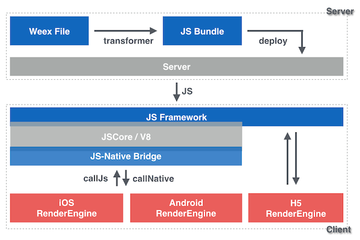

# 多端开发

## WebView

> [Webview 使用攻略](https://www.jianshu.com/p/3c94ae673e2a)

- 是一个基于 webkit 内核，展现 web 页面的空间
  - 4.4 后浏览器内核使用 Chromium

### 基本使用

首先，一定要添加网络权限

```xml
<uses-permission android:name="android.permission.INTERNET">
```

避免内存泄漏

1. 不在 xml 中定义，而是动态创建

```java
webView = new WebView(getApplicationContext());
webview.setLayoutParams();
layout.addView(webView);
```

2. 在 Activity 销毁时让 WebView 加载 null

```java
public void onDestroy() {
    if (webView != null) {
        webView.loadDataWithBaseURL(null, "", "text/html", "utf-8", null);
        webView.clearHistory();
        ((ViewGroup) webView.getParent()).removeView(webView);
        webView.destroy();
        webView = null;
    }
    super.onDestroy()
}
```

Back 键回退网页而非直接关掉浏览器

```java
public boolean onKeyDown(int keyCode, KeyEvent event) {
    if ((keyCode == KEYCODE_BACK) && webView.canGoBack()) { 
        webView.goBack();
        return true;
    }
    return super.onKeyDown(keyCode, event);
}
```

## 微信小程序和 H5 区别

- 运行环境
  - H5：浏览器，移动端的 WebView
  - 小程序：基于浏览器内核重构的一个解析器
- 开发语言
  - 小程序：WXML + WXSS
- 开发成本
  - H5：框架 + 构建 + 兼容性......
  - 小程序：统一的开发工具和标准
- 系统权限
  - H5：依赖于浏览器
  - 小程序：能通过微信客户端获取到更多系统权限
- 服务器
  - 小程序：使用的域名必须 https 备案
- 体验
  - 小程序：首次打开小程序后可以缓存很多资源，使用更加流畅

## Weex 架构

> [官方文档](https://esmeetu.gitbooks.io/weex/content/advanced/how-it-works.html)

- 组成部分
- Transformer

  - 是一个 NodeJS 工具
  - 负责将 <template> 和 <style> 转换为 json 结构
  - 然后把上面两部分和 <script> 结合成一个 AMD 模块
- Weex JS Framework

  - 可以理解为客户端上的 Vue 框架
  - 运行于客户端的的 JS 框架，管理着 Weex 实例的运行
  - 发送/接受 Native 渲染层产生的系统调用，从而间接的响应用户交互
- WXBridge
    - 客户端的 JS 执行环境和客户端是隔离的
    - 和 Native 通过 callNative 和 callJs 交互
- Native 引擎
    - 在不同的端上，有着不同的实现
    - 有着共同的组件设计，模块 API 和渲染效果，所以能配合同样的 JS Framework 和 JS Bundle 工作
- 过程

  - 服务端
    - 编写 Weex 的 .we 源码
    - 通过 Transformer 将 .we 转换为 JS Bundle
    - JS Bundle 被部署到服务器
  - 客户端
    - 初始化 Weex SDK
      - 初始化 JS 执行环境（JS Core（IOS）或 V8（浏览器））
      - 加载 JS Framework（内置在 SDK 中，不需要网络下载）
      - 初始化 WXBridge
    - 下载 JS Bundle，创建一个 Weex 实例
      - 每个实例都有一个 instance id
    - 通过 JS Bundle 生成 VDOM，通过 Native DOM API 更新到真实视图（类似 patch）
    - WXBridge 将 Native DOM API 转化为 Platform API（Weex SDK 提供），发送给渲染引擎
- 渲染过程
    - VDOM
    - 构造树结构：分析虚拟 DOM 的 JSON 数据以构造渲染树 (RT)
    - 添加样式：为渲染树的各个节点添加样式
    - 创建视图：为渲染树各个节点创建Native视图
    - 绑定事件：为 Native 视图绑定事件
    - [CSS布局](https://github.com/facebook/css-layout)：使用 `css-layout` 来计算各个视图的布局
    - 更新视窗(Frame)：采用上一步的计算结果来更新视窗中各个视图的最终布局位置
    - 最终页面呈现



## RN 原理

> [ReactNative 之原理浅析](http://www.fly63.com/article/detial/5654?type=3)