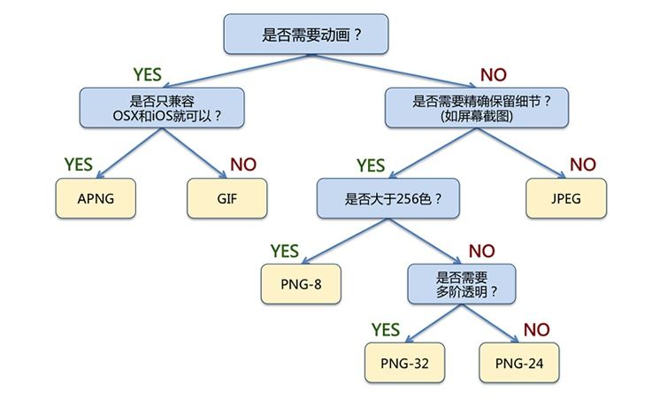

# 性能优化

## 防抖和节流

- 防止一些持续触发的事件（如 resize，scroll，mousemove 等）频繁地触发执行函数

- 防抖
  
  - 原理：认为持续触发事件是不合理行为，持续触发就要持续等待，直到行为停止（稳定）
  - 非立即执行：只有在触发事件后一定时间内不再触发事件，才会执行函数
  
  ```js
  function debounce(func, wait) {
      let timer;
      return function () {
          let context = this;
          let args = arguments;
          if (timer)
              clearTimeout(timer);
          timer = setTimeout(() => {
              func.apply(context, args)
          }, wait);
      }
  }
  ```
  
  - 立即执行：函数立即执行，只有在接下来的一段时间内不触发事件才能继续执行函数
  
  ```js
  function debounce(func, wait) {
      let timer;
      return function () {
          let context = this;
          let args = arguments;
          if (timer)
              clearTimeout(timer);
          let stable = !timer;
          timer = setTimeout(() => {
              timer = null;
          }, wait)
          if (stable)
              func.apply(context, args);
      }
  }
  ```

- 节流
  
  - 原理：允许连续触发事件，但一定时间内只执行一次函数
  - 时间戳版
  
  ```js
  function throttle(func, interval) {
      let ago = 0;
      return function() {
          let now = Date.now();
          let context = this;
          let args = arguments;
          if (now - ago > interval) {
              func.apply(context, args);
              ago = now;
          }
      }
  }
  ```
  
  - 定时器版
  
  ```js
  function throttle(func, wait) {
      let timeout;
      return function() {
          let context = this;
          let args = arguments;
          if (!timeout) {
              timeout = setTimeout(() => {
                  timeout = null;
                  func.apply(context, args);
              }, wait);
          }
      }
  }
  ```

- 理解
  
  - 针对的是一些小孩哭闹着（疯狂触发事件）想要玩游戏（执行函数）
  - 防抖是等他们稳定下来之后才给他们玩一次游戏
  - 节流是保持他们每一个小时只能玩一次游戏

## 图片优化

- 选择格式，详见 [图片格式](##图片格式)
- 响应式图片：在 640x360 的图片框里显示也要那 1920x1080 的图片，太浪费
- 图片压缩
- 少用图片：尽量用 icon-font 和 css 完成
- 懒加载：先加载占位图，当用户将要看到图片时再赋真的 src

## 图片格式

- 像素点（颜色点）
  - RGB/RGBA
  - 每个分量用 1 byte 表示，所以 RGB 24 bit，RGBA 32 bit
- 图像是二维数据，但在内存中一维存储
- 像素 32 位对齐
  - CPU 处理 32 的整数倍会更快
  - 因此可以采取在行尾添加冗余数据的方式凑足 32 的整数倍
  - 比如 5 像素的 RGB 图片位数为 5*24 = 120，在行尾添加 8 位冗余凑足 128
- BMP
  - 位图：Bit Map
  - 几乎不压缩
  - 是 Windows 中的标准图像文件格式
  - 图像信息较丰富
  - 分类：根据每个像素的位数分为
    - 1：单色位图
    - 4：16 色位图
    - 8：256 色位图
    - 16：16bit 高彩色位图
    - 24：24bit 真彩色位图
    - 32：32bit 增强型真彩色位图
- PNG
  - 便携式网络图形：Portable Network Graphics
  - 无损压缩
  - 渐进传输：在图像完全下载之前先提供一个基本的图像内容，然后逐渐清晰
  - 支持透明效果：可以定义 256 个透明层次，使得边缘能与任何背景平滑融合，彻底消除锯齿边缘
    - GIF 和 JPEG 没有
  - 分类
    - PNG 8：可索引 2^8 色，支持布尔透明（全透明/不透明）和 256 阶 alpha 透明
    - PNG 24：可索引 2^24 色，不支持透明
    - PNG 32：可索引 2^24 色，支持 256 阶 alpha 透明
- JPEG
  - 联合图像专家组：Joint Photographic Experts Group
  - 和 JPG 是一个东西，由于扩展名常用三位才使用 .jpg
  - 压缩率高
  - 能够利用可变的压缩比控制文件大小
  - 分类
    - 标准 JPEG
      - 以 24 位颜色存储单个光栅图像
      - 有损压缩
      - 由上而下线性显示
    - 渐进式 JPEG
      - 渐进传输
    - JPEG 2000
      - 压缩率比标准 JPEG 高约 30％
      - 支持 无损 和 有损 压缩
      - 渐进传输
- GIF
  - 图形交换格式：Graphics Interchange Format
  - 采用 LZW 压缩算法
  - 不支持 24bit 彩色模式，最多存储 256 色；适用于色彩较少的图片
  - 可以根据 GIF 自带调色板的特性来减少图像使用的颜色数
- JFIF
  - JPEG 档案交换格式：JPEG File Interchange Format
  - 详细说明如何从一个 JPEG 串流，产出一个适合于电脑储存和网络传输的档案
- SVG
  - 可缩放矢量图形：Scalable Vector Graphics
  - 使用 XML 格式定义图形
  - 在放大或改变尺寸的情况下图形质量不会损失
  - 与 JPEG 和 GIF 相比，尺寸更小，可压缩性更强
  - 可以使用 JS 操作
- WebP
  - Google 开发
  - 支持 无损 和 有损压缩
  - 压缩率比 JPEG 更高，但编码时间比 JPEG 更长
  - FireFox 和 IE 不支持，兼容性差
- APNG
  - Animated PNG
  - 基于 PNG 的位图动画格式，对传统 PNG 保留向下兼容
- 总结

> 有损压缩的压缩率高

| 图片格式 | 压缩方式 | 透明度 | 动画  | 浏览器兼容          | 适应场景        |
| ---- | ---- | --- | --- | -------------- | ----------- |
| JPEG | 有损   | 不支持 | 不支持 | 所有             | 复杂颜色、形状     |
| GIF  | 无损   | 支持  | 支持  | 所有             | 简单颜色，动画     |
| PNG  | 无损   | 支持  | 不支持 | 所有             | 需要透明时       |
| APNG | 无损   | 支持  | 支持  | Firefox/Safari | 需要透明动画时     |
| WebP | 有损   | 支持  | 支持  | Chrome系        | 复杂颜色、形状     |
| SVG  | 无损   | 支持  | 支持  | IE8+           | 简单图形，需要缩放控制 |



## 事件委托

- 利用事件冒泡，只指定一个事件处理程序，就可以管理某一类型的所有事件
  - 不必遍历添加 clickHandler，减少 DOM 操作

```html
<ul id="list">
    <li>hxwnb</li>
    <li>hxwsb</li>
</ul>
```

```js
document.getElementById('list').onclick = function(event) {
    if (event.target.nodeName.toLowerCase() === 'li') {
        alert(target.innerHTML)
    }
}
```

## 浏览器缓存

- 浏览器发起请求
- 在浏览器缓存中查找
  - 若不存在该资源的缓存标识，向服务器发请求
  - 若存在该资源的缓存标识，但已失效，强制缓存失效，使用协商缓存
  - 若存在该资源的缓存标识，且未失效，强制缓存生效，直接返回
- 缓存规则
  - Expires
    - HTTP/1.0
    - 缓存的到期时间，相对于服务器时间（如果客户端和服务器时区不同会带来问题）
  - Cache-Control
    - HTTP/1.1
    - 优先级高于 Expires
    - 取值
      - public：任何设备（如代理服务器）都可以缓存
      - private：只有客户端可以缓存（默认）
      - no-cache：在发布缓存副本之前，强制要求缓存把请求提交给原始服务器进行验证 (协商缓存验证)
      - no-store：不使用任何缓存
      - max-age=600：过期时长（s）
- 强制缓存：客户端直接使用缓存，与服务端无通讯
- 协商缓存
  - 一定与服务端通讯，由服务端决定是否使用缓存
  - Etag & If-None-Match
    - Etag
      - 服务端返回的资源文件的一个唯一标识（服务端生成）
    - If-None-Match
      - 当缓存过期时，客户端请求时携带 If-None-Match: Etag
      - 服务端比较其与此资源的 Etag，若相同返回 304，若不相同重新返回资源（200）
    - 优先级低于强制缓存，但刷新页面时浏览器会忽略强制缓存重新请求，这时结合使用 Etag 就能返回 304 减少开销
  - Last-Modified & If-Modified-Since
    - Last-Modified
      - 服务端返回的该资源在服务器最后被修改的时间
    - If-Modified-Since
      - 客户端发送时携带上次请求返回的 Last-Modified
      - 服务端判断，若该资源最后被修改时间大于此就重新返回资源
    - 优先级低于 Etag
      - 缺点：文件属性修改而内容未修改时仍然请求；精度只到秒级
- 测试
  - 开发者工具中，状态码为灰色就说明使用了缓存
  - Size 会显示两种
    - from memory cache（图片）
    - from disk cache（CSS）

## CRP 优化

- 关键路径渲染（Critical Rendering Path）优化
- CRP 指从 HTML+CSS+JS 到 页面像素内容 的一系列过程
- 关键因素
  - 关键资源：网页首次渲染所需要的资源数
    - 减少数量，增加内联（相当于把多个资源整合在一个资源中）
  - 关键路径：获取所有关键资源所需的时间
    - 尽早下载 CSS（因为 CSSOM 不阻塞 DOM 但阻塞 Render Tree）
    - `<script async>`：不阻塞渲染，后台下载解析；解析完成后立即执行（执行依然会阻塞渲染）；与 DOMContentLoaded 事件没有必然关系
    - `<script defer>`：不阻塞渲染，后台下载解析；在 DOM 加载完毕后按序执行；执行完成后触发 DOMContentLoaded 事件
    - 压缩：如 [gzip](## gzip)
  - 关键字节：网页首次渲染所需要的字节数
    - 删除不必要的注释和空格（uglify）

## 指标

> 时间获取基于浏览器的 Performance API，[详见](https://zhuanlan.zhihu.com/p/82981365)

- 起点
  - navigationStart：输入 URL 回车；点击刷新（重定向、卸载页面一般没什么用）
  - fetchStart：浏览器准备通过 HTTP 请求资源（所以一般用这个）
- 白屏时间：第一个元素开始渲染的时间
  - DOM 树解析完毕，准备渲染
  - domInteractive - fetchStart
- 首屏时间：首屏资源全部加载完毕的时间
  - 页面加载完毕，准备执行 onload 回调
  - loadEventStart - fetchStart
- 首屏时间（用户角度）：首屏可见内容全部加载完毕的时间
  - 模拟一：首屏截图不再变化
  - 模拟二：首屏内图片的最迟加载时间（默认图片对加载的影响最大）
- [以用户为中心的性能指标](https://www.jianshu.com/p/456e6eff59c8)
  - 首次绘制（FP）；首次内容绘制（FCP）
  - 首次有效绘制（FMP）；主要元素时点（HET - Hero Element Timing）
  - 可交互时点（TTI - Time to Interactive）

## gzip

- GNUzip
- 流程
  - 浏览器发送请求，携带首部 Accept-Encoding: gzip
  - 服务器知晓客户端支持，于是用 gzip 压缩资源并返回，携带首部 Content-Encoding: gzip
- nginx 配置
  - gzip on
  - gzip_comp_level：压缩比，1~9，越小压缩效果越差、但越快
  - gzip_min_length：需要压缩的最小字节数，默认为 0，建议大于 1K
  - gzip_types：需要压缩的媒体类型，强制启用 text/html
  - gzip_buffers：允许使用多少内存缓存压缩结果，"4 16K" 代表 4*16K

## 首屏优化

> [性能优化之首屏加载](除了上文的缓存、CRP 优化、gzip 压缩之外)

- 除了上文的缓存、CRP 优化、gzip 压缩之外，还有以下一些方法

- 骨架屏：防止白屏时间过长

- 懒加载：路由懒加载，动态引入，项目拆分

- 预渲染：大致同 SSR，将一些静态性较强的页面预先渲染好

- \<link rel="prefetch" /\>：较晚使用的资源，闲时下载

- \<link rel="preload" as="script" /\>：非常需要的资源，优先下载，通过 as 设置正确的 Accept 请求头