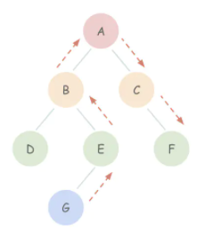

# 架构设计

## MVC，MVP，MVVM

> [MVC，MVP 和 MVVM 的图示](http://www.ruanyifeng.com/blog/2015/02/mvcmvp_mvvm.html)

- MVC
  - Model，View，Controller
  - 通信（均为单向）
    - V 传送指令到 C
    - C 执行业务逻辑更新 M
    - M 将新的状态发送给 V 显示
- MVP
  - Model，View，Presenter
  - 通信（均为双向）
    - V 传送指令到 P；P 使用新数据渲染 V
    - P 执行业务逻辑更新 M；M 将更新结果返回给 P
  - 与 MVC 区别
    - MVC 中的 V 可以直接访问 M，因此不可避免地包含业务逻辑，而这部分逻辑是难以复用的
    - 而当你把 V 与 M 的交互弱化，放到 C 中，就渐渐变成了 MVP
- MVVM
  - Model，View，ViewModel
  - 同 MVP，唯一区别：View-ViewModel 双向绑定，变更自动反应到另一边

## Flux

> Flux 是 Facebook 提出的一种架构

- 为什么需要
  - 情景：多个视图依赖同一状态，来自不同视图的行为需要变更同一状态
  - 如果按照组件间传递数据的方法，G 的行为要改变 F 的状态，就要走一个复杂的数据流，期间各组件的状态难以预测

- 核心理念：单向数据流
- 组成元素
  - View：请求 Store 中的数据用于渲染；监听 Store 的 change 事件做视图更新；发出 Action
  - Store：存储数据和业务逻辑；在 Dispatcher 上注册一个参数为 Action 的回调；可以有多个 Store
    - 回调通过 Action.type 选择更新逻辑，然后广播一个事件声明状态已更改
  - Dispatcher：调度中心；本身没有功能，只是把 Action 传入每个 Store 注册的回调
    - 可以依据 Store 之间的依赖需要，定义 Store 更新的顺序：waitFor()
  - Action：Store 中的数据只能通过 Action 修改；包含 type 和 data
